Cognitive Services Face API
============

> NOTE: this lab has been adapted from [David Giard's Hands-on Labs repository](https://github.com/DavidGiard/Cognitive-Services-Labs).

Microsoft Cognitive Services is a set of APIs that use the power of Machine
Learning to analyze, pictures, video, speech, and language.

Working through this set of exercises will help you understand how to call these
APIs, what data is required, and what data is returned.

Prerequisites: Azure Account and Editor
=======================================

This lab requires an Azure account. If you do not yet have an Azure account,
navigate to <https://azure.microsoft.com/>; click the [Start Free] button and
follow the instructions to sign up for a free Azure trial.


You will need an editor for Exercise 4. I prefer Visual Studio Code, because it
is free, lightweight, and will run on Windows , MacOS, or Linux. You can
download Visual Studio Code at <https://code.visualstudio.com/>. But feel free
to use any editor with which you are comfortable.

Exercise 1: Get an API Key
==========================

In order to work with Cognitive Services, you will need an API key. Navigate to
the Azure Portal (<https://portal.azure.com>) and log in if prompted.

NOTE: If you do not have an Azure account, see the Prerequisites section above.

Click the [+ New] button in the left menu

NOTE: For some accounts, the word “New” is replaced by the words “Create a
resource”.


This will open the New Resource blade.

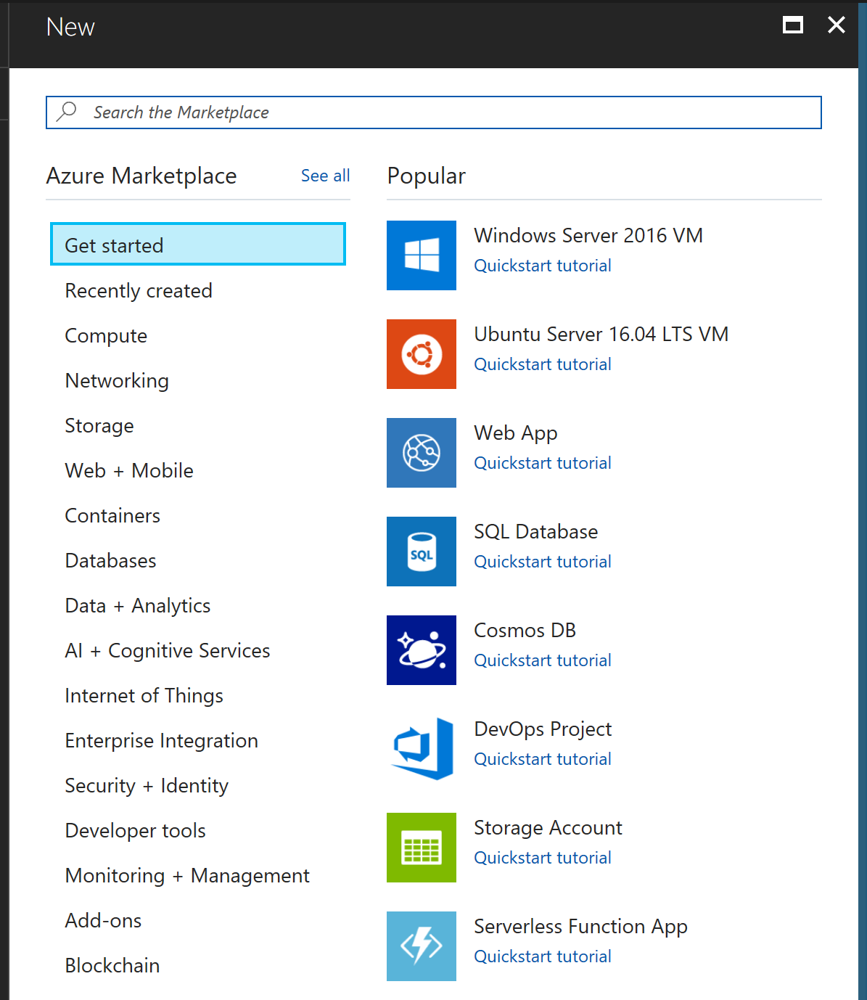

In the “Search” box, enter “Emotion API” and press ENTER. The search results
should list “Emotion API (preview).

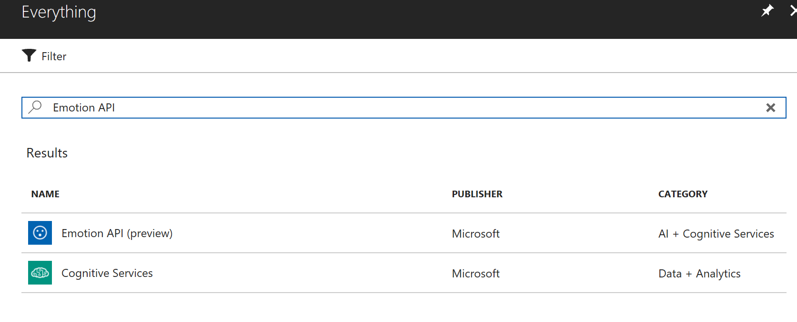

Click “Emotion API (preview)” to open the “Emotion API (preview)” blade.

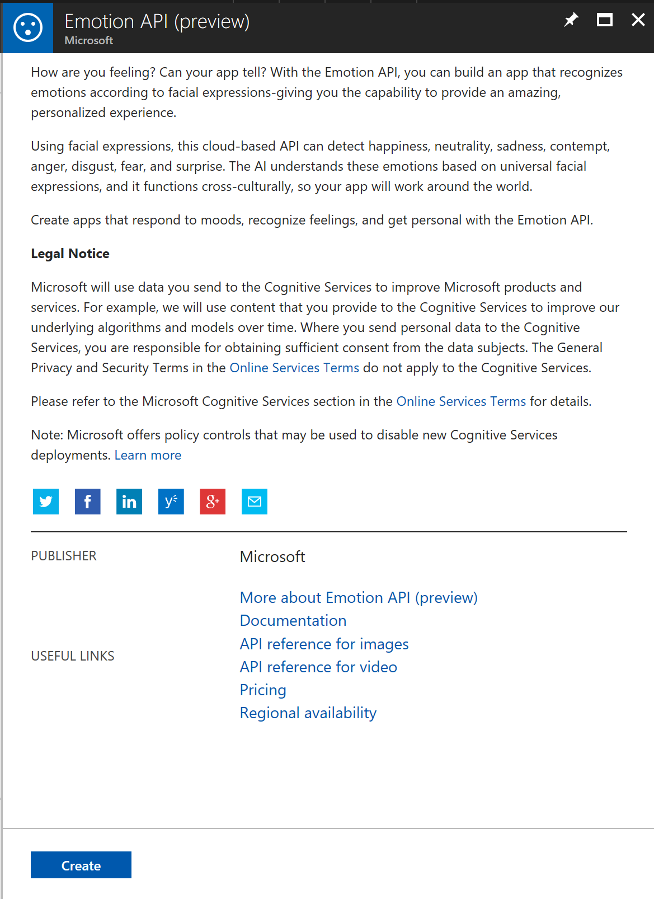

Click the [Create] button to open the “Create Emotion API” blade.

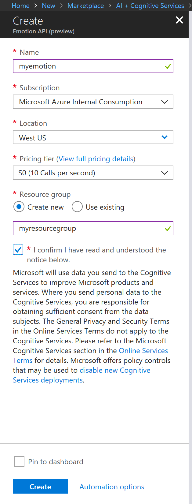

  
At the “Name” field, enter a name for this key.

At the “Location” dropdown, select “West US”.

At the “Pricing Tier” dropdown, select “S0”.

At the “Resource Group” field, select the “Create new” radio button and enter a
name for a resource group. A Resource Group is a logical container for Azure
resources.

Check the “Pin to dashboard” checkbox.

Check the checkbox to indicate you agree with whatever it says in the fine print
below it; and click the [Create] button to create a new Emotion API key.

After a few seconds, the key will be created and a shortcut will appear on your
desktop. Click the shortcut to open the newly-created Cognitive Services blade.

NOTE: You can also open this blade by “All resources” in the left menu and
selecting your newly-created Cognitive Service from the list.

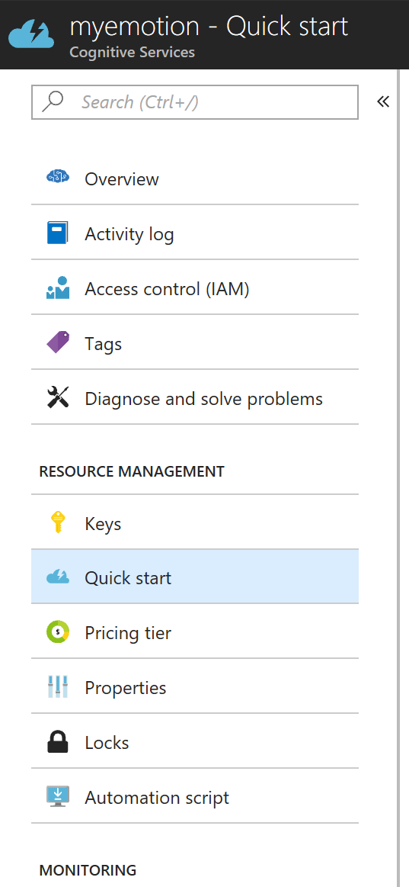

There are 2 key pieces of information in this blade: the endpoint and the access
key. You can get to both from the “Overview” tab. Click the “Overview” link to
open the “Overview” tab.

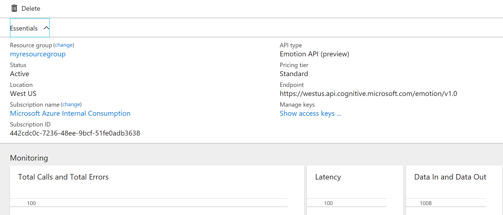

Record the Endpoint (probably
https://westus.api.cognitive.microsoft.com/emotion/v1.0). You can copy this
endpoint by clicking the Copy icon to the right of the URL.

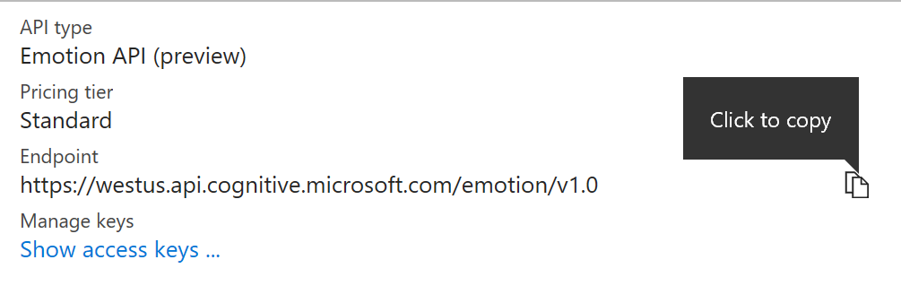

Click the “Show access keys…” link to open the “Manage keys” blade.

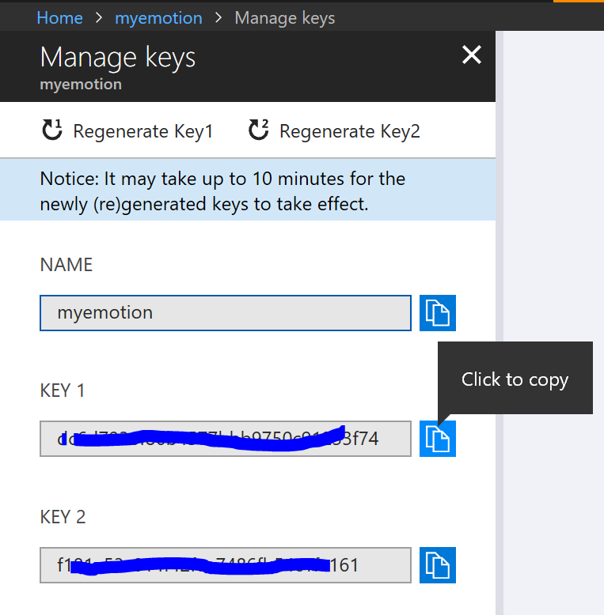

Record the value in KEY 1. You can copy this value by clicking the Copy icon to
the right of the key.

NOTE: Cognitive Services provides 2 keys in case one of the keys is compromised
and you need to re-generate it.

Exercise 2: Explore Cognitive Services
======================================

Open a new browser tab and navigate to the Cognitive Services home page at
<https://microsoft.com/cognitive-services>.

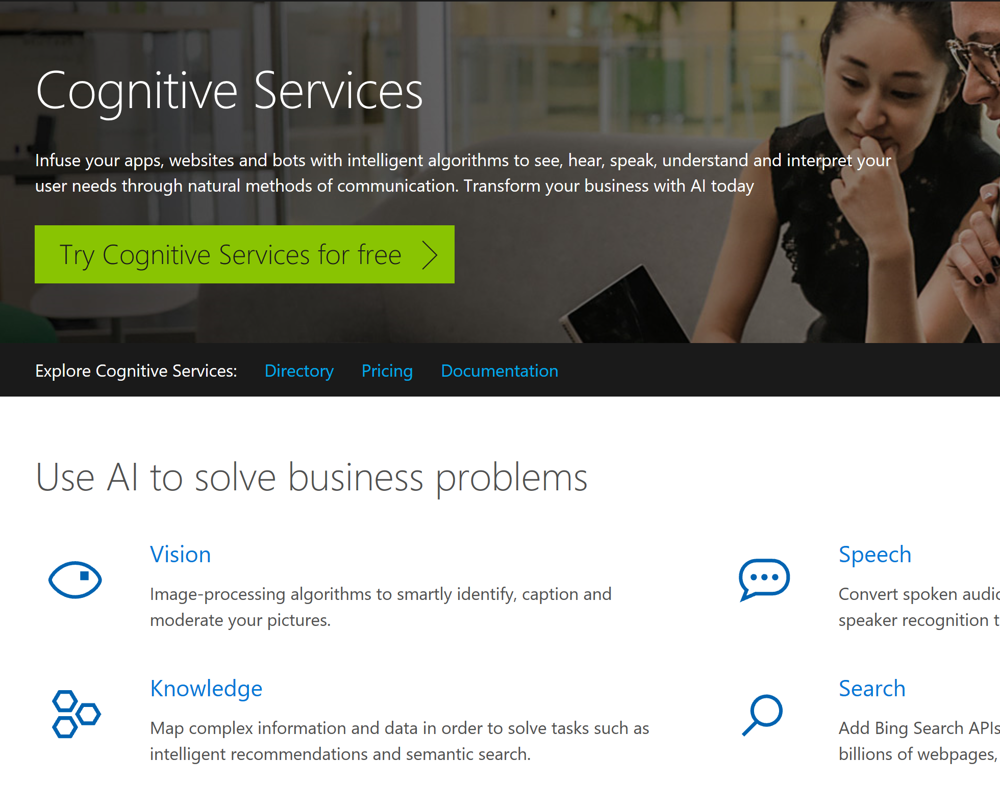

Click the “Vision” link to display the Cognitive Services Vision page.

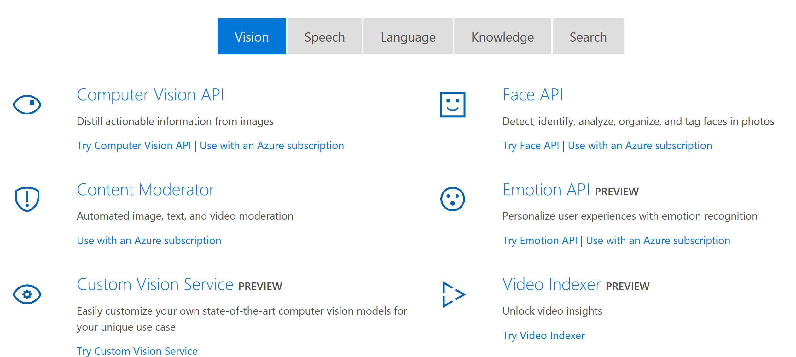

Click the “Emotion API” link to navigate the Emotion API page.


Scroll down to below the “See it in action” section.

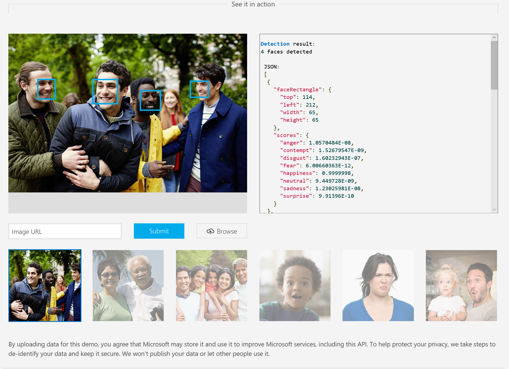

Click each of the images; observe the JSON returned from the API call. Note that
it always returns an array of faces, even though sometimes there is only one
face in the array. Note that each face includes a numeric score (between 0 and
1) for 8 different emotions.

Try it with one of your own images – either from your computer or from a web
search.

Exercise 3: Use the API Testing Console
=======================================

Near the top of the Emotion API page is a menu with links to documentation, the
API reference, and other useful information.


Click the “API” link in this menu to navigate to the Emotion API page.

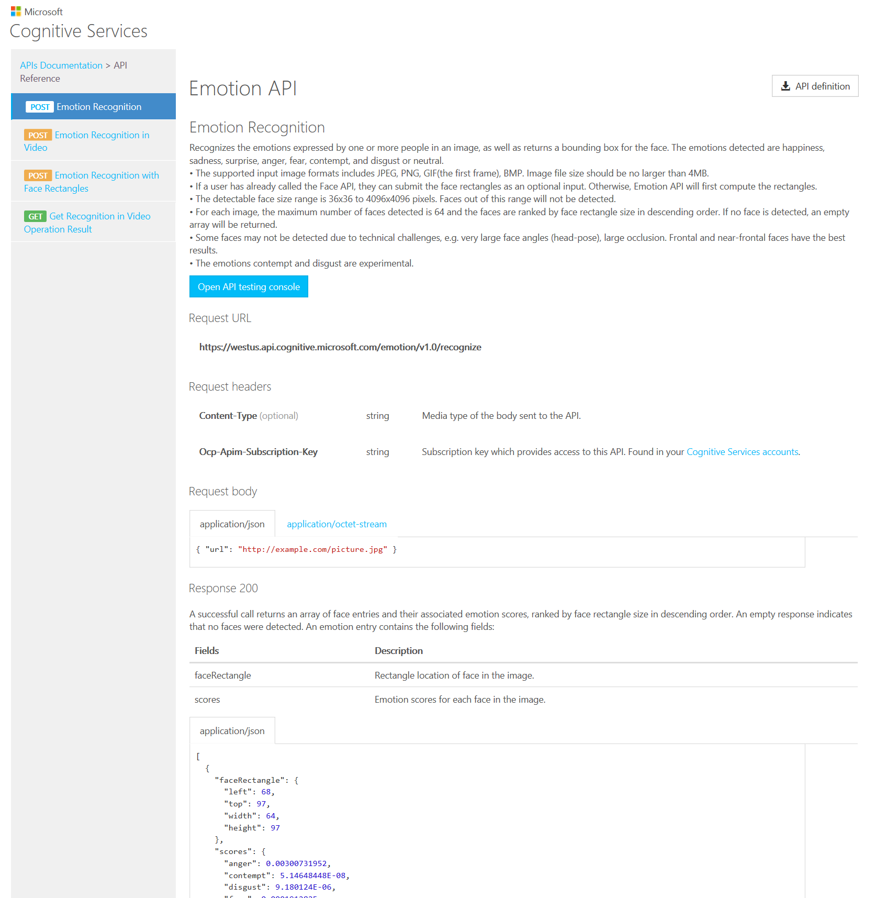

This page documents how to call the Emotions API web service, what parameters to
pass and what response to expect. By default, the “Emotion Recognition” method
is shown. Review this documentation.

Click the [Open API testing console] button to navigate to the Emotion API
Testing console.

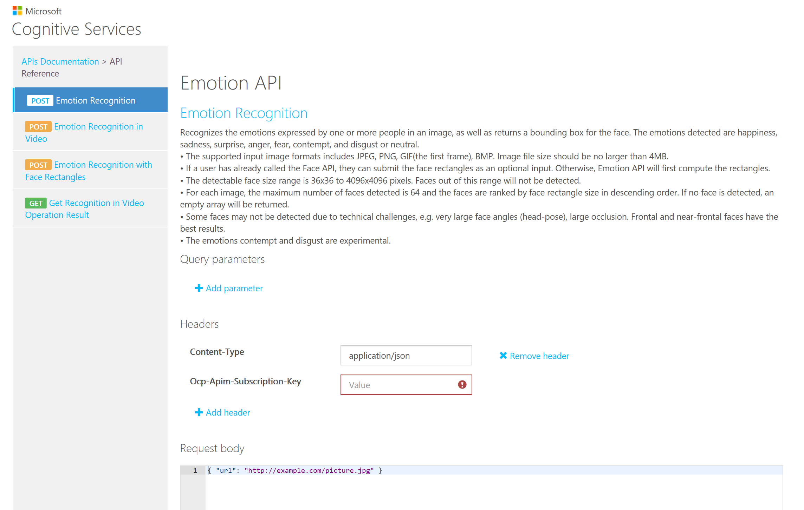

At the “Content-Type” dropdown, select “application/json”.

At the “Ocp-Apim-Subscription-Key” field, enter your Emotion API key from
Exercise 1.

At the “Request body” field, enter

{ "url": "
https://photos.smugmug.com/Tech-Community/GANGConf-2017/i-H2ZNBJT/0/c28d08df/L/IMG_7743-L.jpg"
}

NOTE: The URL above is a photo of the 5 mostly happy people below. You can
replace it with any image on the web that contains faces.  


Details of the request will display at the bottom of the screen. Review these
details.

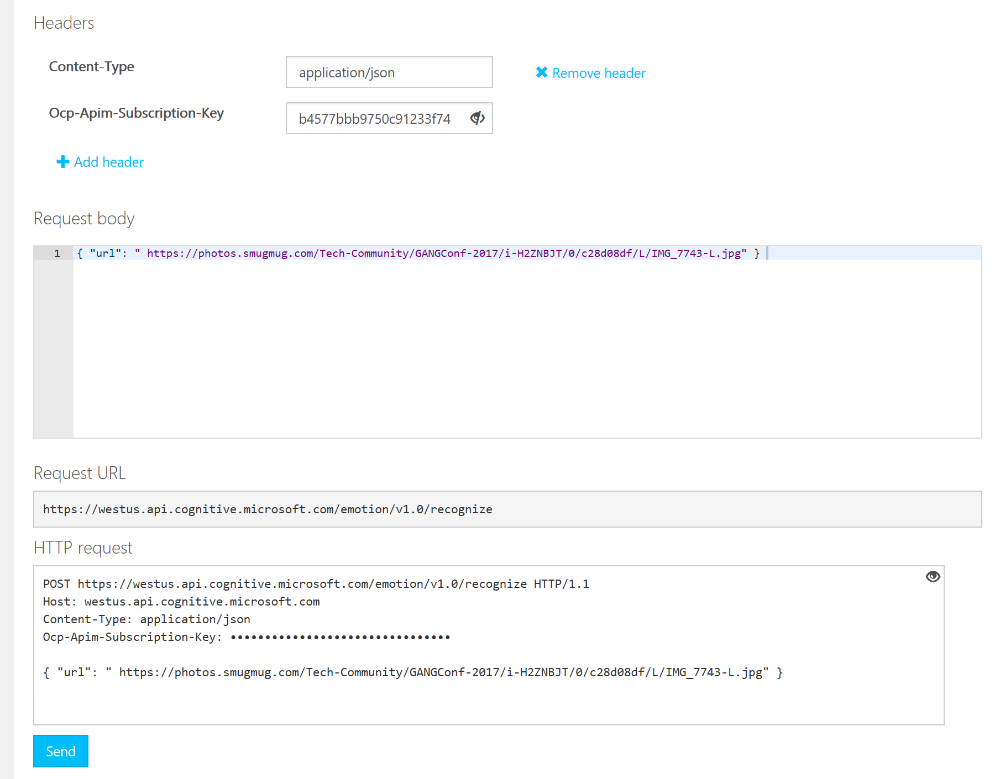

Click the [Send] button to send an HTTP request. An HTTP request will be sent to
the web service URL and you will receive an HTTP response. The details of this
response will display at the bottom of the screen.


If everything worked properly, you should receive a response status of “200 OK”
and JSON with information about each face in the photo will display.

Review the response.

Any Response status of 400 or above indicates an error. Common errors are:

-   Entering an incorrect Ocp-Apim-Subscription-Key

-   Creating your key in the wrong region (This test is designed to work with
    West US)

-   Providing an image URL that either does not exist or is not publicly
    accessible

Exercise 4: Calling a Web Service from JavaScript
=================================================

In this exercise, we will write some JavaScript to call the Image Analysis API
and examine the data returned.

We will write JavaScript code to analyze the emotions of the faces in the photo
below (found online at
<https://photos.smugmug.com/Tech-Community/GANGConf-2017/i-H2ZNBJT/0/c28d08df/L/IMG_7743-L.jpg>.


Create a folder named “CogSvcs” lab and navigate to this folder.

From this folder, launch Visual Studio Code the editor of your choice.

Create a file named “index.html”.

Add the following code to this index.html:


```html
<html>

<head>

<title>Emotions API Demo</title>

<script
src="https://ajax.googleapis.com/ajax/libs/jquery/3.1.1/jquery.min.js"></script>

<script src="script.js"></script>

</head>

<body>

<h1>Microsoft Cognitive Services</h1>

<h2>Emotions API Lab</h2>

<div>Image URL:</div>

<input

type="text"

id="imageUrlTextbox"

class="urlInput"

value="https://photos.smugmug.com/Tech-Community/GANGConf-2017/i-H2ZNBJT/0/c28d08df/L/IMG_7743-L.jpg">

<button id="analyzeImageButton">Analyze Image </button>

<div id="ResultsDiv"></div>

<div id="AngerDiv"></div>

<div id="ContemptDiv"></div>

<div id="DisgustDiv"></div>

<div id="FearDiv"></div>

<div id="HappinessDiv"></div>

<div id="NeutralDiv"></div>

<div id="SadnessDiv"></div>

<div id="SurpriseDiv"></div>

<div>


</div>

</body>

</html>
```

Create a file named “script.js”

Add the following code to script.js:

```js
$(function () {

$("#analyzeImageButton").click(function () {

getImageInfo();

});

var getImageInfo = function () {

var subscriptionKey = "EmotionAPIKey";

var imageUrl = $("#imageUrlTextbox").val();

var webSvcUrl =
"https://westus.api.cognitive.microsoft.com/emotion/v1.0/recognize";

var resultsDiv = $("#ResultsDiv");

if (imageUrl) {

var body = '{ "url": "' + imageUrl + '" }';

$.ajax({

type: "POST",

url: webSvcUrl,

headers: {"Ocp-Apim-Subscription-Key": subscriptionKey},

contentType: "application/json",

data: body

}).done(function (data) {

var scores = data[0].scores;

var angerScore = scores.anger;

var contemptScore = scores.contempt;

var disgustScore = scores.disgust;

var fearScore = scores.fear;

var happinessScore = scores.happiness;

var neutralScore = scores.neutral;

var sadnessScore = scores.sadness;

var surpriseScore = scores.surprise;

var angerText = "Anger Score: " + angerScore.toFixed(2);

var contemptText = "Contempt Score: " + contemptScore.toFixed(2);

var disgustText = "Disgust Score: " + disgustScore.toFixed(2);

var fearText = "Fear Score: " + fearScore.toFixed(2);

var happinessText = "Happiness Score: " + happinessScore.toFixed(2);

var neutralText = "Neutral Score: " + neutralScore.toFixed(2);

var sadnessText = "Sadness Score: " + sadnessScore.toFixed(2);

var surpriseText = "Surprise Score: " + surpriseScore.toFixed(2);

$("#AngerDiv").text(angerText);

$("#ContemptDiv").text(contemptText);

$("#DisgustDiv").text(disgustText);

$("#FearDiv").text(fearText);

$("#HappinessDiv").text(happinessText);

$("#NeutralDiv").text(NeutralText);

$("#SadnessDiv").text(sadnessText);

$("#SurpriseDiv").text(surpriseText);

$("#ResultsDiv").text("Success!");

}).fail(function (err) {

$("#ResultsDiv").text("ERROR!" + err.responseText);

});

}

};

});
```

Replace *EmotionAPIKey* with your Emotion API key created in Exercise 1.

Save both files. Open index.html in a web browser.

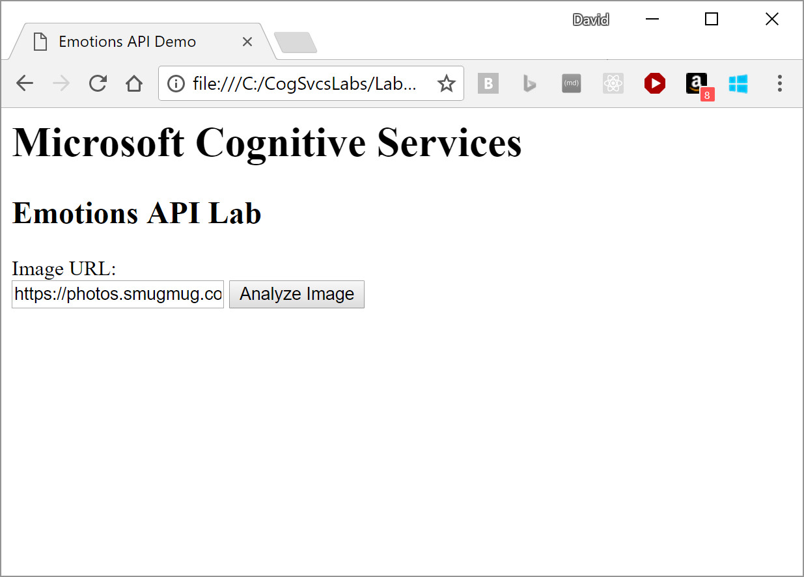

Click the [Analyze Image] button. You should see the scores displayed.

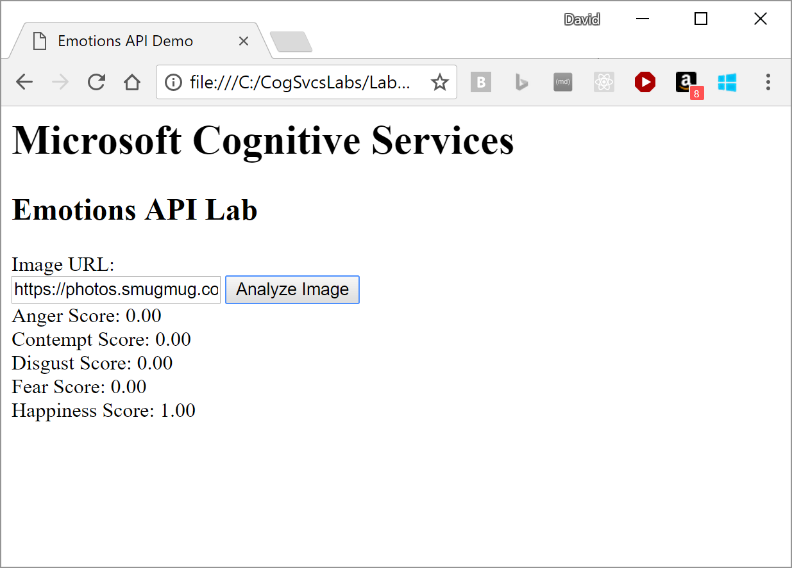

If errors are reported, use the browser’s developer tools to step through and
find these errors. Pressing F12 brings up these tools in most browsers.

Search the web for more photos of faces with varying emotions and paste these
into the “Image URL” text box.

Exercise 5: Calling a Web Service from Python
=============================================

We can use the free Jupyter notebooks hosted on Azure to run Python code.

We will write Python code within a Jupyter notebook to analyze the emotions of
the faces in the photo below (found online at
<https://photos.smugmug.com/Tech-Community/GANGConf-2017/i-H2ZNBJT/0/c28d08df/L/IMG_7743-L.jpg>.


Navigate to <https://notebooks.azure.com/>

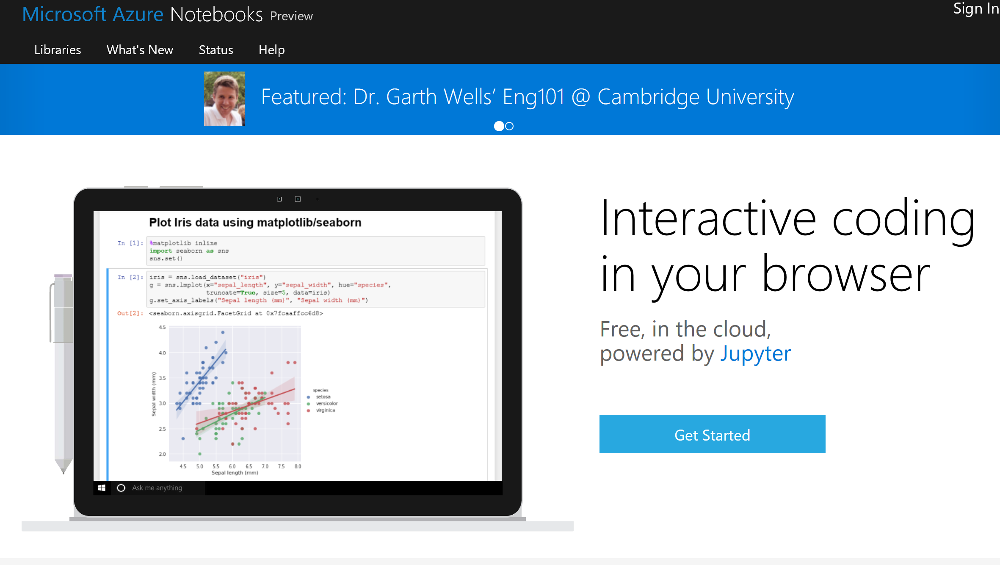

Click the [Get Started] button to display a *Sample Notebooks* library.


  
Click the “Clone” link to create a copy of this library.

You may be prompted to log in with a Microsoft account (e.g., an outlook.com,
live.com, or hotmail.com login).

After you sign in, the “Clone Library” dialog displays.

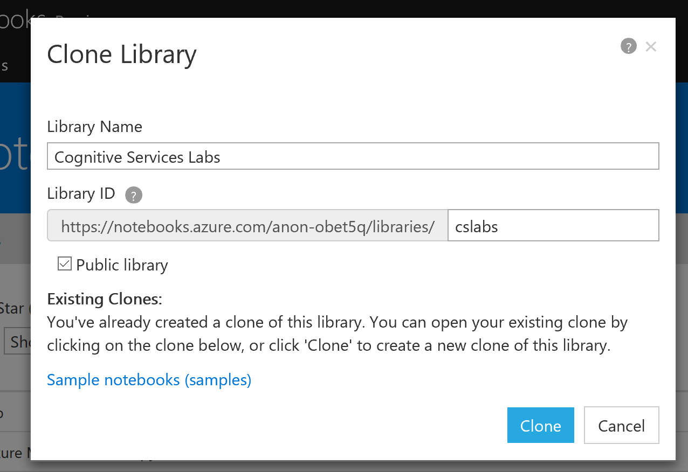

Enter a descriptive name for the library and a url to access it. The URL may
contain only letters, numbers, and hyphens.

Click the [Clone] button to create a new library identical to the sample
library.

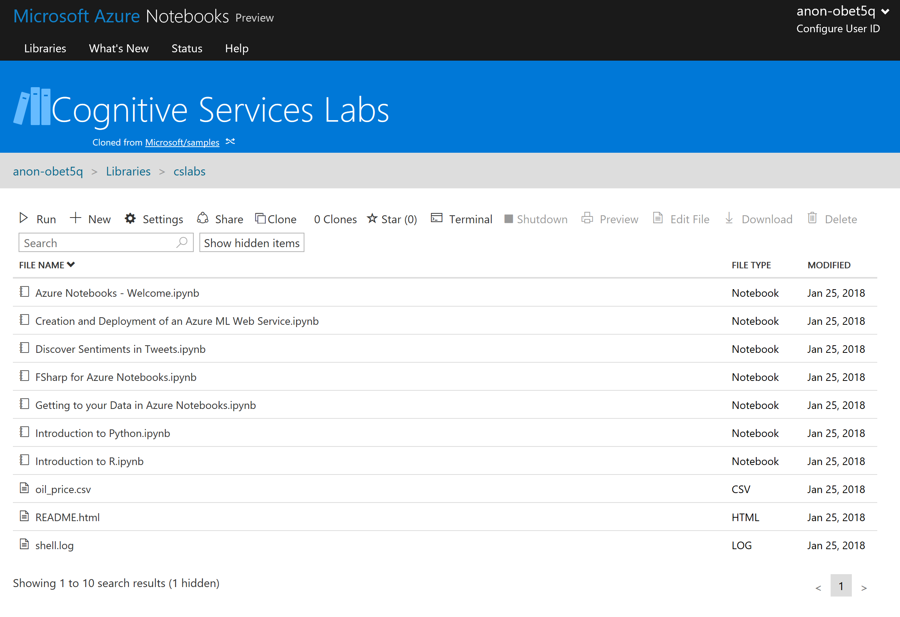

Click the [+ New] link to open the “Add Items to Library” dialog.

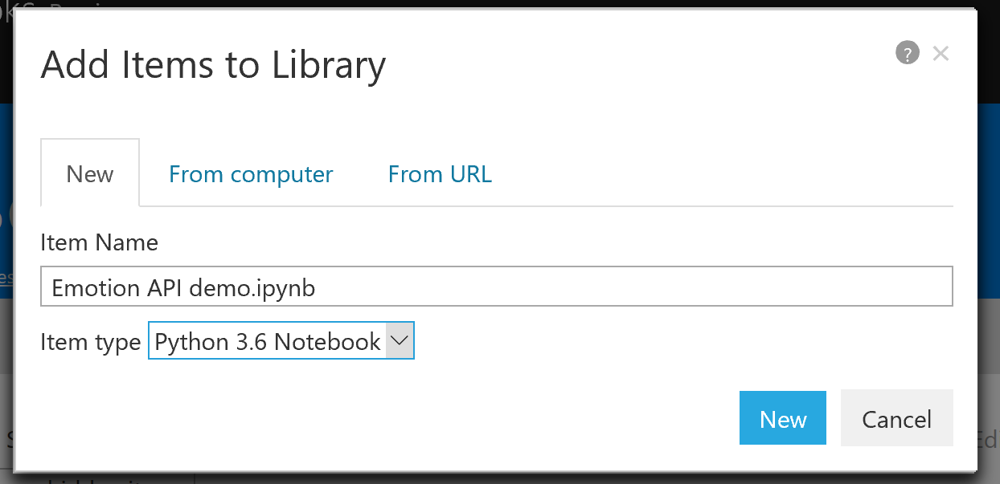

At the “Item Name” textbox, enter “Emotion API demo”.

From the “Item type” dropdown, select “Python 3.6 Notebook”.

Click the [New] button to create a new Jupyter notebook and add it to this
library.

The newly-created notebook will now be listed in the library.


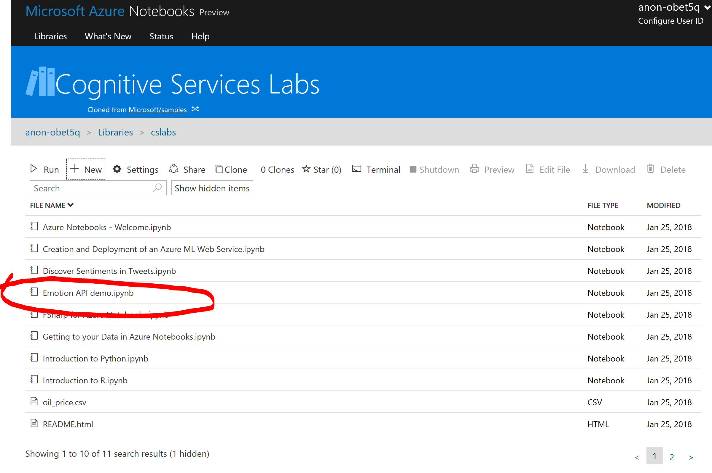

Click the “Emotion API demo.ipynb” link to open this notebook. The notebook will
be empty except for an empty code box.


  
  
Paste the following code into the code box:

```python
import http.client, urllib.request, urllib.parse, urllib.error, base64  
headers = {  
    # Request headers  
    'Content-Type': 'application/json',  
    'Ocp-Apim-Subscription-Key': 'EmotionAPIKey',  
}  
  
params = urllib.parse.urlencode({})  
  
try:  
    conn = http.client.HTTPSConnection('westus.api.cognitive.microsoft.com')  
    conn.request("POST", "/emotion/v1.0/recognize?%s" % params, "{'url':
    'https://photos.smugmug.com/Tech-Community/GANGConf-2017/i-H2ZNBJT/0/c28d08df/L/IMG_7743-L.jpg'}",
    headers)  
    response = conn.getresponse()  
    data = response.read()  
    print(data)  
    conn.close()  
except Exception as e:  
print("[Errno {0}] {1}".format(e.errno, e.strerror))  
```

Replace *EmotionAPIKey* with your Emotion API key created in Exercise 1.

Click the [Run] button on the toolbar.

If everything is correct, you should see JSON returned from the Emotion API
describing the image in the URL.


If an error is reported, review your code and correct the error.
